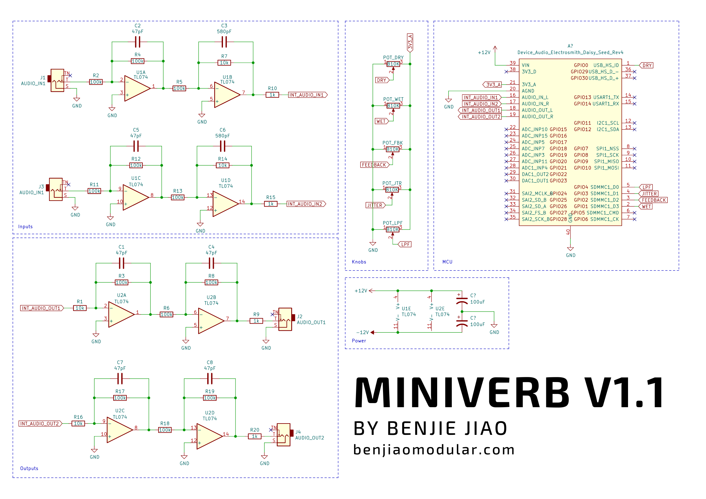

# MiniVerb
A reverb module based around the Daisy Seed platform.

## PCB Versions

### 1.1
First batch of corrections
- Fixed pot connections
- Make IN(R) use IN(L) when no jack is inserted.

### 1.0 (not working)
Initial release (does not work out of the box)
- Pots connected to the wrong pins on the Daisy

